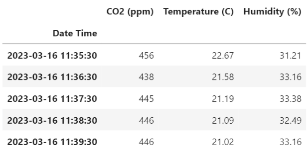
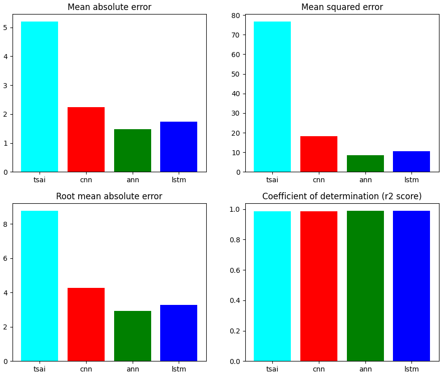

# [Time Series](https://en.wikipedia.org/wiki/Time_series) Analysis

"Time series" is a term commonly used in the field of statistics and data analysis. It refers to a collection of data points that are measured over a period of time. Each data point in the series is typically recorded in chronological order, with a corresponding timestamp indicating when it was measured.

Time series data can be used for a wide range of applications, such as forecasting future trends, identifying patterns or cycles in the data, and making informed decisions based on historical performance. Examples of time series data include stock prices over time, temperature readings over the course of a day or year, and the number of website visitors per hour.

Analyzing time series data often involves identifying trends, seasonality, and other patterns in the data, as well as developing statistical models to help forecast future values. Time series analysis is widely used in fields such as economics, finance, engineering, and environmental science, among others.

## Data

Weekly greenhouse air index. There are dimensions of carbon dioxide, temperature and humidity. Metrics measured every minute. 70% of the data is training and the rest is testing.

## Trained models

### 1. [tsai](https://pypi.org/project/tsai)

 - tsai is an open-source deep learning package built on top of Pytorch & fastai focused on state-of-the-art techniques for time series tasks like classification, regression, forecasting, imputation…
 - tsai is currently under active development by timeseriesAI.
 - r2_score = 0.9837
 - [notebook](tsai.ipynb)

### 2. [1D CNN](https://en.wikipedia.org/wiki/Convolutional_neural_network)

 - "1D CNN" refers to a one-dimensional convolutional neural network. CNNs are a type of neural network that is commonly used in image recognition and computer vision tasks, but 1D CNNs are designed to work with one-dimensional data, such as time series or audio signals.
 - r2_score = 0.9864
 - [notebook](1D_CNN.ipynb)

### 3. [ANN](https://en.wikipedia.org/wiki/Artificial_neural_network)

 - "ANN" stands for Artificial Neural Network, which is a type of machine learning algorithm inspired by the structure and function of the human brain. 
 - ANN is a computational model that is composed of interconnected processing units (also known as "neurons") that work together to solve complex problems.
 - r2_score = 0.9872
 - [notebook](ANN.ipynb)

### 4. [LSTM](https://en.wikipedia.org/wiki/Long_short-term_memory)

 - "LSTM" stands for Long Short-Term Memory, which is a type of recurrent neural network (RNN) that is designed to handle the issue of vanishing gradients in traditional RNNs.
 - An LSTM network is composed of memory cells, which are designed to maintain a long-term memory of past inputs, and gates, which regulate the flow of information into and out of the memory cells.
 - r2_score = 0.9877
 - [notebook](LSTM.ipynb)

## Compare

